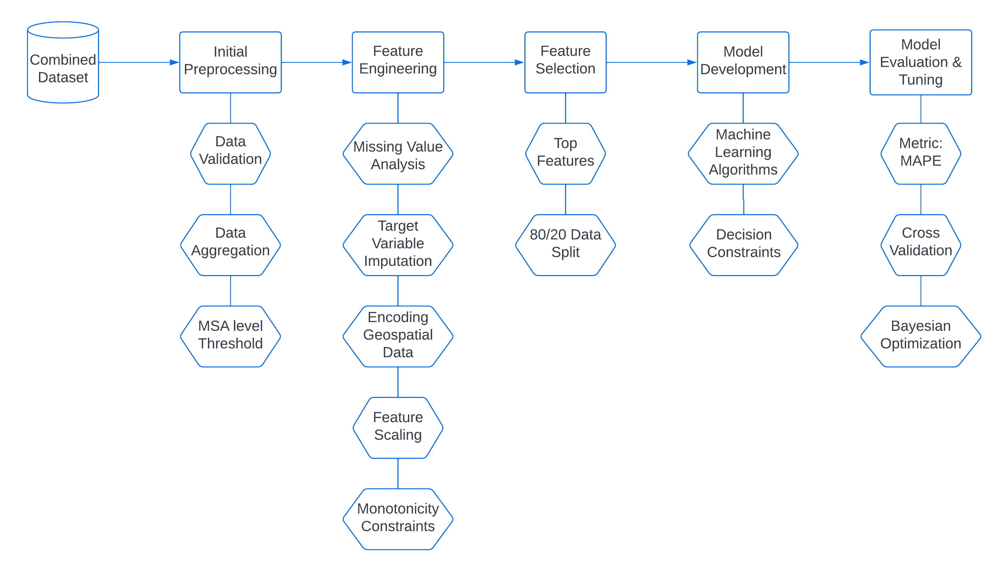

# Prediction of Commercial Insurance Payments for Surgical Procedure using DataRobot
[![build status][1]][2]

## Business Problem
* Predict the claim amount for MSA having less than 10 procedures.
* Validate the results for the DataRobot models developed by the J&J team.
* Develop a production level Machine Learning Framework for predicting Insurance Payments for surgical procedures. 
* If possible, improve the model performance from the Baseline DataRobot models.
* Models and code to be delivered in Python.

## Languages and Tools

  

## Project Structure and Approach Outline

## Documentation
[Technical Report](https://github.com/rjrahul24/Prediction-of-Insurance-Payments-for-Surgical-Procedures/blob/rahul-feature-branch/docs/J%26J_Tong_%20Insurance_Prediction_1st_report.docx.pdf)

## Instructions for Project Setup
Please run the following jupyter notebooks in sequence:
1. Run the `Final Code Snippet/Capstone_Step1_Data_Preprocessing.ipynb` notebook responsible for transforming raw datasets into a preprocessed dataset. Please edit the file paths to `data/raw` folder.
2. Afterwards, run `Final Code Snippet/Capstone_Step2_Data_Modelling.ipynb`responsible for performing data modelling and model evaluation.
3. Run `Final Code Snippet/Capstone_Step3_XGBoost_Model.ipynb`responsible for XGBoost modelling and enforcing the monotonicity constraints. Please ensure that output of Step 1 and Step 2 has been generated before running Step 3.

## Credits

### Authors
- Rahulraj Singh -  Team Captain [`rs4211@columbia.edu`]
- Prerit Jain [`pj2383@columbia.edu`]
- Mahesh Jindal [`mj3038@columbia.edu`]
- Parth Gupta [`pg2677@columbia.edu`]
- Ayush Baral [`ab5247@columbia.edu`]

### Sponsors/Mentors (J&J Team)
- Cindy Tong - Project Lead and Domain Expert
- Ziyu Tan - Technical Expert and go-to person for DataRobot
- Katherine Etter - Mentor and Knowledge Expert 

### Instructor
Adam S. Kelleher [`ak4063@columbia.edu`]

### CA
Xuanyu Li [`xl3116@columbia.edu`]

[1]: https://img.shields.io/travis/yoshuawuyts/github-standard-labels/master.svg?style=flat-square
[2]: https://travis-ci.org/yoshuawuyts/github-standard-labels
